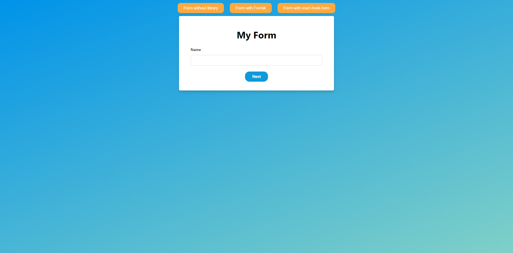

# 🤖 MultistepForm

## Table of contents

- ℹ️ [General info](#ℹ️-general-info)
- 🎉[Project overview](#-project-overview)
- 📖 [What I learned during this project?](#-what-i-learned-during-this-project)
- ⚙️ [Technologies](#️-technologies-used-in-project)
- 📷 [Screenshots](#-screenshots)
- 💾 [Installation](#-installation)
- 📜 [Available scripts](#-available-scripts)
- 🔴 [Live](#-live)

## ℹ️ General info

MultistepForm in React using (Formik, react-hook-form, own script)

## 🎉 Project Overview

This is an application that was intended to teach me how to use the tools, i.e. Formik, or react-hook-form, and recreate the multistep form logic myself.

## 📖 What I learned during this project?

The biggest problem with this application was understanding how the application is supposed to work and how the form state is supposed to be passed. Another problem was handling form errors. Finally, learning to work with Formik, Yup and react-hook-form documentation

## ⚙️ Technologies used in project:

| Tech                                           | Description                                             |
| ---------------------------------------------- | ------------------------------------------------------- |
| [React](https://reactjs.org/)                  | A JavaScript library for building user interfaces       |
| [Typescript](https://www.typescriptlang.org/)  | Javascript superset language                            |
| [Formik](https://formik.org)                   | Most popular open source form library for React         |
| [React-hook-form](https://react-hook-form.com) | Library that helps you validate forms in React          |
| [Yup](https://github.com/jquense/yup)          | Schema builder for runtime value parsing and validation |
| [Sass](https://sass-lang.com/)                 | Css extension                                           |
| [Eslint](https://eslint.org/)                  | Javascript Linter                                       |
| [Prettier](https://prettier.io/)               | Code formatter                                          |

## 📷 Screenshots

<p align="center">
    
</p>

## 💾 Installation

To run this project, install it locally using npm:

```
git clone

npm install

npm start
```

## 📜 Available scripts

| Command         | Description            |
| --------------- | ---------------------- |
| `npm start`     | Start local server     |
| `npm run build` | Create optimized build |

## 🔴 Live

https://multistep-form-danilus120.netlify.app/
